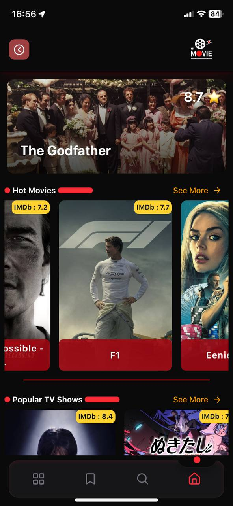
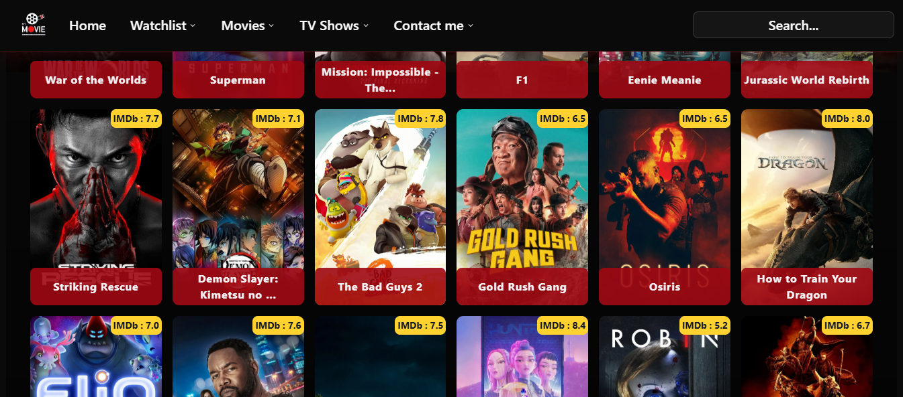

<div align="center">

# 🎬 My Movies

A fast, responsive movie & TV web app with infinite scrolling, precise scroll-restore, PWA support, and clean, reusable UI.

**Live demo → https://my-movies-olive-six.vercel.app/**

[]()
[]()
[]()
[]()
[]()
[]()
[]()
[]()

</div>

---

## Table of Contents

-   [Features](#features)
-   [Screenshots](#screenshots)
-   [Tech Stack](#tech-stack)
-   [Getting Started](#getting-started)
    -   [Prerequisites](#prerequisites)
    -   [Environment Variables](#environment-variables)
    -   [Install & Run](#install--run)
    -   [Build & Production](#build--production)
-   [Project Structure](#project-structure)
-   [Implementation Notes](#implementation-notes)
-   [Deployment](#deployment)
-   [Roadmap](#roadmap)
-   [Contributing](#contributing)
-   [License](#license)
-   [Contact](#contact)
-   [Acknowledgements](#acknowledgements)

---

## Features

-   🔄 **Infinite scroll** for movie/TV lists (TanStack Query v5)
-   🎯 **Scroll restore**: return from details to the exact card position
-   ⚡ **SSR/ISR** for first pages (better SEO & TTFB)
-   📱 **Responsive** layout + **Mobile bottom navbar**
-   🚀 **PWA** (manifest, theme color, iOS meta)
-   🧩 **Reusable components** & clean code
-   🎨 **shadcn/ui + Tailwind** styling
-   📊 **Vercel Analytics** & **Speed Insights**
-   🛠️ Performance optimizations (preconnect to images, caching)
-   ✅ Type-safe with **TypeScript**

---

## Screenshots

> Put your images in `public/screenshots/` and keep these names or adjust paths.

<p align="center">
  
  &nbsp;&nbsp;
  
</p>

---

## Tech Stack

-   **Framework:** Next.js 15 (App Router), React 19, React DOM 19
-   **Data/Caching:** TanStack React Query v5 (infinite queries)
-   **Styling:** Tailwind CSS 4, shadcn/ui
-   **Player:** react-player
-   **Lang/Tooling:** TypeScript 5, ESLint 9
-   **Hosting:** Vercel

---

## Getting Started

### Prerequisites

-   **Node.js 18+**
-   **npm** (project uses npm scripts)

### Environment Variables

Create a `.env.local` in the project root:

```bash
# TMDB v3 API key (simple key, sometimes used in query string)
TMDB_KEY=YOUR_TMDB_V3_API_KEY

# TMDB v4 access token (Bearer token used in Authorization header)
TMDB_ACCESS_TOKEN=YOUR_TMDB_V4_READ_TOKEN


# Install & Run
npm install
npm run dev
# Build & Production
npm run build
npm run start

# Available scripts
{
  "dev": "next dev --turbopack",
  "build": "next build",
  "prod": "next build && next start",
  "start": "next start",
  "lint": "next lint"
}

# Project Structure
app/
  _components/
  _context/
  _hooks/
  _lib/
  _styles/
  _types/
  [media]/
           |[slug]
           |genre
  categories/
  search/
  watchlist/
public/
  manifest.json
  sw.js
  icons/

  Implementation Notes

Infinite Query keys
Every list uses a stable key: ["media", apiPath].
Pagination is handled via getNextPageParam using TMDB page / total_pages.

Scroll Restore
Before navigating to details, the list stores:

pos (container scrollTop)

anchorId (media-<id>)
under sessionStorage key scroll:${apiPath}.
On return, the page scrolls to the anchor (or falls back to pos) and loads more pages if needed.

Caching
React Query is configured with generous staleTime/gcTime.
Optional persistence with @tanstack/react-query-persist-client can keep pages across reloads/session.

PWA
manifest.json, theme-color, and iOS meta for a native-like experience.

Performance
preconnect to https://image.tmdb.org, SSR/ISR (revalidate: 86400), and lazy components where appropriate.

Deployment

Vercel

Connect the Git repository to Vercel.

Add environment variables (TMDB_KEY, TMDB_ACCESS_TOKEN) in Project Settings → Environment Variables.

Build command: npm run build. Output directory: .next.

Set your custom domain if needed.

Roadmap

⬇️ Download & streaming — coming soon

Persist React Query cache in sessionStorage/localStorage

More skeletons/shimmers & micro-interactions

E2E tests with Playwright

Contributing

PRs are welcome!
Please:

Branch from main.

Run npm run lint and ensure the app builds.

Include screenshots/notes in the PR description.

License

MIT — feel free to use, modify, and distribute with attribution.

Contact

Email: itssorenadev@gmail.com

WhatsApp: +90 539 967 6995

Acknowledgements

Data provided by The Movie Database (TMDB)
 — this project is not affiliated with or endorsed by TMDB.

Icons by lucide-react.

Thanks to the Next.js and TanStack communities.

```
